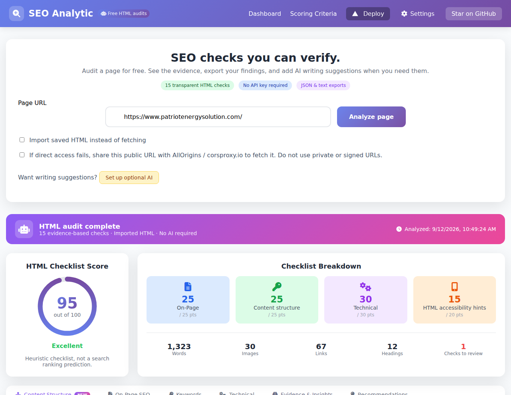

# SEO Analytic

**Free, inspectable single-page SEO audits. Optional AI writing suggestions.**

[](https://github.com/deb1265/SEO_ANALYTIC/actions/workflows/ci.yml)

Find missing page metadata, inspect headings and links, and export an audit with evidence for every check. The core audit runs without an API key, account, or paid service.



## Quick start

Requires Node.js 22.12+ and npm.

```sh
git clone https://github.com/deb1265/SEO_ANALYTIC.git
cd SEO_ANALYTIC
npm ci
npm run dev
```

Open the local URL printed by Vite. Enter a public page URL and choose **Analyze page**.
Most websites block cross-origin browser reads. You can explicitly enable the public-proxy fallback, or save the page HTML and choose **Import saved HTML**. Import keeps the audit local unless you separately enable AI.

## What you get

- 15 deterministic HTML checks with expandable evidence and actionable suggestions.
- Metadata, headings, body-term counts, internal/external links and nested JSON-LD types.
- JSON and text reports you can share or compare.
- Optional OpenRouter copy suggestions that cannot overwrite the factual checklist.
- Clear unavailable states for performance, originality, actual indexing and mobile usability.

The existing hosted app at [seo-analytic.vercel.app](https://seo-analytic.vercel.app) may still run the previous version until the owner deploys these changes. Use the quick start to try this version.

## Scoring

This is a **product checklist, not Google's ranking formula**. A high score does not imply strong rankings, valid rich results or that a page is indexed. The 15 checks and weights are defined in [`src/utils/audit.ts`](src/utils/audit.ts).

| Category | Checks and points | Maximum |
| --- | --- | ---: |
| On-page | Title 10; description 10; H1 present 5 | 25 |
| Content structure | Body text 10; paragraph 5; H2 5; internal link 5 | 25 |
| Technical hints | HTTPS URL 5; canonical present 5; no blocking robots meta 10; JSON-LD type 5; Open Graph title 5 | 30 |
| HTML accessibility hints | Device-width viewport 10; language 5; all images have nonempty alt 5 | 20 |

Presence checks do not validate quality. Empty alt is correct for decorative images and needs manual review. JSON-LD presence does not validate a schema. A robots meta check cannot inspect HTTP headers, robots.txt or Google's index. Import uses the supplied original URL, so redirects/HTTPS must be checked separately. Word counts use whitespace; term counts tokenize letters/numbers and omit a small English stop-word list. Keyword density is not search demand.

Title and description character counts are guidance, not fixed Google limits: [title links](https://developers.google.com/search/docs/appearance/title-link), [snippets](https://developers.google.com/search/docs/appearance/snippet).
Performance needs measurements: [Core Web Vitals](https://web.dev/articles/vitals). This app does **not** invent LCP, INP or CLS from HTML.

## Privacy and optional services

- Direct fetching omits credentials and times out after 12 seconds per attempt. Only public hostnames are accepted; no IP literals, local hostnames or embedded credentials.
- Public proxies are opt-in. AllOrigins and corsproxy.io receive the entire URL when used; do not submit private or signed URLs. Proxy HTML is not independently authenticated and may differ from the origin. Imports are the reliable fallback.
- HTML is limited to 5 MB and parsed without executing scripts. JavaScript-rendered content may be absent. Bot-block pages can still look like HTML: inspect the extracted title/text before trusting results.
- API credentials stay in memory until refresh. Only the AI model preference persists; legacy stored credentials are erased on startup.
- Optional AI sends page text to OpenRouter. Optional DataForSEO requests send the title/domain when AI enhancements are enabled and provider credentials exist. Provider charges may apply. No API key is bundled through public environment variables.
- The legacy Vercel deployment utility remains separate from auditing and requires a session token. It has not been exercised against a real Vercel account in this change. Prefer deploying your own repository through Vercel's dashboard.

## Reproduce an audit from HTML

Save a public page's source to an HTML file, then:

```sh
npm run audit:html -- saved-page.html https://www.patriotenergysolution.com/
```

The helper uses the exact same extraction and scoring functions as the browser. It does not execute page scripts or fetch additional URLs. [Patriot case study](docs/patriot-audit.md) records observations and testing limits.

## Development

```sh
npm test
npm run build
npx playwright install chromium
npm run test:browser
```

See [CONTRIBUTING.md](CONTRIBUTING.md), the issue templates and the [adoption roadmap](docs/maintainer-roadmap.md). Good next features include rendered-page measurements, multilingual term analysis and historical report comparison.

## Support the project

If this saves you time, star the repo and share a reproducible issue or useful example. Contributions and clear bug reports make the tool better for everyone.

## License

No open-source license has been chosen by the repository owner. Public visibility does not grant a general reuse license. An explicit owner-selected license is a remaining step before promoting this as an open-source project.
